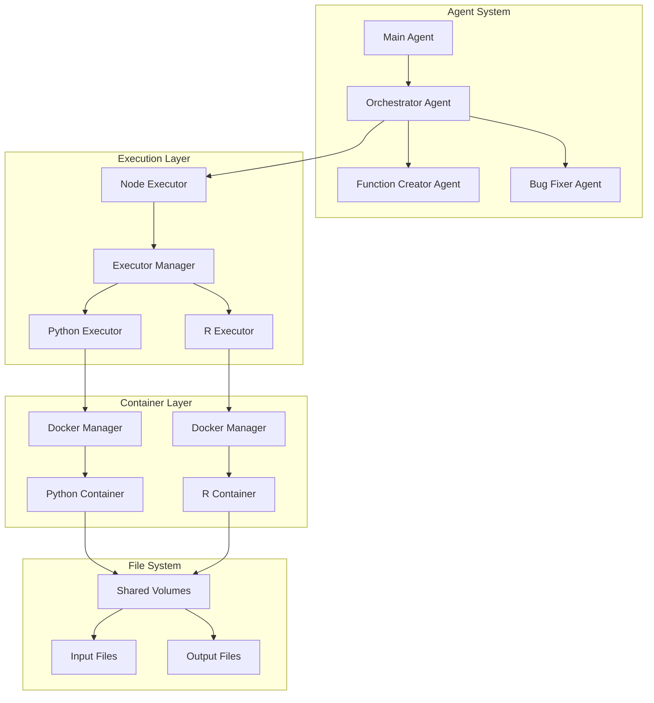
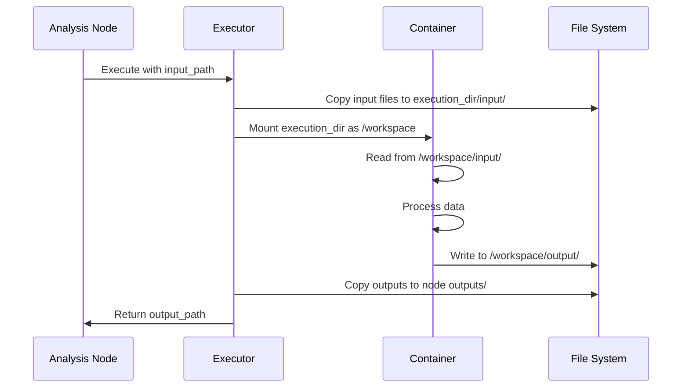
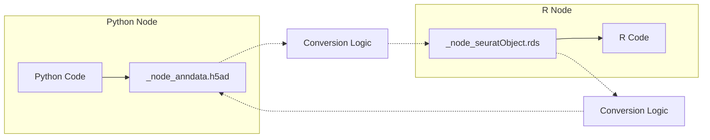

# R/Python Container Architecture with Agents and Executors

## Overview

This document describes how R and Python code execution works within the Ragomics agent system using Docker containers. The architecture provides isolated, reproducible environments for executing scientific computing workflows while maintaining data consistency across different language runtimes.

## Architecture Diagram



## Component Details

### 1. Agent Layer

The agent system orchestrates the entire workflow:

- **Main Agent**: Entry point that processes user requests
- **Orchestrator Agent**: Manages parallel execution of analysis nodes
- **Function Creator Agent**: Generates function blocks (R/Python code)
- **Bug Fixer Agent**: Debugs failed executions

### 2. Execution Management

#### Node Executor (`analysis_tree_management/node_executor.py`)
- Manages the execution of individual analysis nodes
- Creates directory structure for each node
- Handles input/output file management
- Tracks execution state and results

Key responsibilities:
- Creates node directory structure:
  ```
  tree_id/
  └── nodes/
      └── node_<id>/
          ├── function_block/
          ├── jobs/
          ├── outputs/
          └── agent_tasks/
  ```
- Manages data flow between parent and child nodes
- Collects execution results and logs

#### Executor Manager
- Routes execution requests to appropriate language executor
- Manages executor lifecycle
- Provides unified interface for different execution environments

### 3. Language-Specific Executors

#### Python Executor (`job_executors/python_executor.py`)
- Prepares Python execution environment
- Handles package installation via `requirements.txt`
- Creates wrapper script for execution
- Manages standard input/output conventions

Key features:
- Input/output directory structure:
  ```
  execution_dir/
  ├── input/
  │   └── _node_anndata.h5ad
  ├── output/
  │   ├── _node_anndata.h5ad
  │   └── figures/
  ├── function_block.py
  ├── requirements.txt
  └── run.py (wrapper)
  ```
- Automatic data structure inspection and logging
- Standard naming convention for data files

#### R Executor (`job_executors/r_executor.py`)
- Prepares R execution environment
- Handles package installation (CRAN, Bioconductor, GitHub)
- Creates R wrapper script
- Manages R-specific data formats

Key features:
- Input/output directory structure:
  ```
  execution_dir/
  ├── input/
  │   └── _node_seuratObject.rds
  ├── output/
  │   ├── _node_seuratObject.rds
  │   └── figures/
  ├── function_block.R
  ├── install_packages.R
  └── run.R (wrapper)
  ```
- Automatic package installation from various sources
- Standard naming convention for R data objects

### 4. Container Management

#### Docker Manager (`utils/docker_utils.py`)
- Interfaces with Docker daemon
- Manages container lifecycle
- Handles volume mounting
- Collects logs and execution results

Key features:
- Container resource limits (CPU, memory)
- Timeout management
- Volume mounting for data exchange
- Log collection (stdout, stderr)

#### Docker Images

**Python Image** (`docker/Dockerfile.python`):
- Base: Ubuntu 22.04
- Includes: Python 3, scientific computing libraries
- Pre-installed: numpy, pandas, scanpy, etc.
- Optimized for single-cell analysis

**R Images**:
- `Dockerfile.r`: Full R environment with Bioconductor
- `Dockerfile.r.seurat`: Lightweight Seurat-specific image
- `Dockerfile.r.conversion`: R-Python conversion utilities
- `Dockerfile.r.basic`: Minimal R environment

## Data Flow

### 1. Input Data Handling



### 2. Parent-Child Data Transfer

When a child node executes:
1. Parent node's entire `outputs/` directory becomes child's input
2. All files are copied maintaining structure
3. Standard files (`_node_anndata.h5ad`, `_node_seuratObject.rds`) are preserved
4. Additional files (figures, metadata) are also transferred

### 3. Cross-Language Data Exchange

The system supports R↔Python data exchange through standardized formats:



## Execution Flow

### 1. Function Block Preparation

```python
# Executor prepares execution directory
def prepare_execution_dir(self, execution_dir, function_block, input_data_path, parameters):
    # 1. Create directory structure
    (execution_dir / "input").mkdir()
    (execution_dir / "output").mkdir()
    (execution_dir / "output" / "figures").mkdir()
    
    # 2. Copy input data
    # If parent exists, copy ALL parent outputs
    # Otherwise, copy initial input file
    
    # 3. Write parameters.json
    # 4. Write function block code
    # 5. Write wrapper script
```

### 2. Container Execution

```python
# Docker Manager runs container
def run_container(self, image, command, volumes, environment, timeout):
    # 1. Create container with resource limits
    # 2. Mount volumes (execution_dir -> /workspace)
    # 3. Set environment variables
    # 4. Execute command
    # 5. Wait for completion
    # 6. Collect logs
    # 7. Clean up container
```

### 3. Result Collection

```python
# Executor collects results
def collect_results(self, execution_dir, output_dir):
    # 1. Copy all files from execution output
    # 2. Track standard output files
    # 3. Collect figures
    # 4. Parse metadata
    # 5. Save execution logs
```

## Key Design Principles

### 1. Isolation
- Each execution runs in isolated container
- No shared state between executions
- Clean environment for each run

### 2. Reproducibility
- Fixed Docker images with version-pinned dependencies
- Consistent file naming conventions
- Preserved execution logs and parameters

### 3. Language Agnostic
- Unified interface for R and Python execution
- Standard data formats for interchange
- Common directory structure

### 4. Error Handling
- Comprehensive logging at each level
- Error propagation from container to agent
- Debug information preservation

### 5. Performance
- Parallel execution support
- Resource limits to prevent system overload
- Efficient file copying strategies

## File Naming Conventions

### Standard Input/Output Files
- Python: `_node_anndata.h5ad` (AnnData format)
- R: `_node_seuratObject.rds` (Seurat format)

### Directory Structure
```
workspace/
├── input/              # Input data directory
├── output/             # Output data directory
│   └── figures/        # Generated plots
├── parameters.json     # Execution parameters
├── function_block.*    # User code (.py or .R)
├── requirements.txt    # Python dependencies
├── install_packages.R  # R dependencies
└── run.*              # Wrapper script
```

## Security Considerations

1. **Container Isolation**: Each execution runs in isolated container
2. **Resource Limits**: CPU and memory limits prevent resource exhaustion
3. **Network Isolation**: Containers run in bridge network mode
4. **File System Access**: Limited to mounted volumes only
5. **No Privileged Access**: Containers run without elevated privileges

## Monitoring and Debugging

### Execution Logs
- Container stdout/stderr captured
- Execution timing and metrics recorded
- Error traces preserved

### Job History
```
node_outputs/
└── jobs/
    ├── job_<timestamp>_<id>/
    │   ├── output/
    │   ├── logs/
    │   │   ├── stdout.txt
    │   │   └── stderr.txt
    │   └── execution_summary.json
    └── latest -> job_<timestamp>_<id>
```

### Debugging Failed Executions
1. Check `stderr.txt` for error messages
2. Review `execution_summary.json` for metadata
3. Inspect input files for data issues
4. Verify package installation logs
5. Check container resource limits

## Future Enhancements

1. **GPU Support**: Add GPU-enabled containers for ML workloads
2. **Caching**: Implement layer caching for faster builds
3. **Distributed Execution**: Support for multi-node execution
4. **Custom Images**: Allow users to provide custom Docker images
5. **Real-time Monitoring**: Stream logs during execution