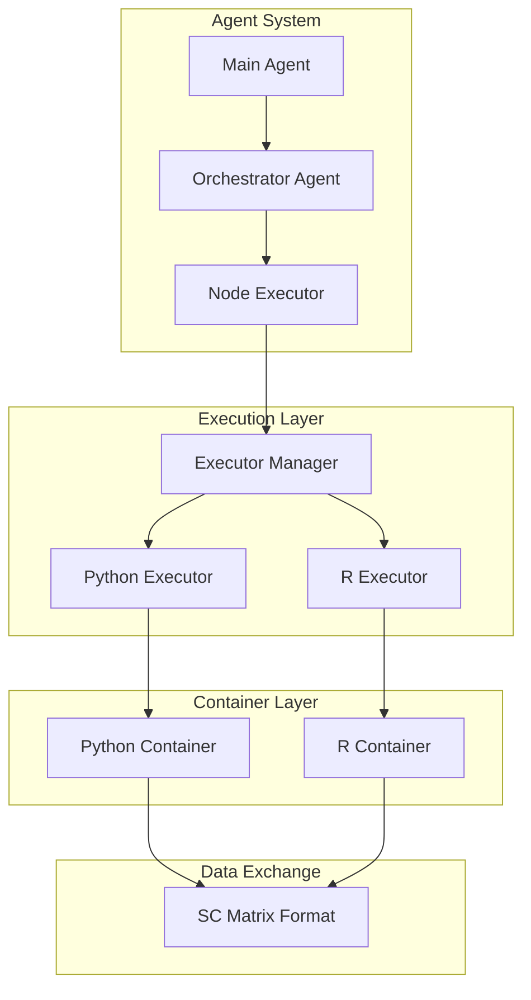

# R/Python Interoperability System

This document consolidates all information about R/Python interoperability, including container architecture, automatic conversion detection, and implementation details.

## Table of Contents
1. [Overview](#overview)
2. [Container Architecture](#container-architecture)
3. [Automatic Conversion Detection](#automatic-conversion-detection)
4. [Data Conversion System](#data-conversion-system)
5. [Implementation Details](#implementation-details)
6. [Testing](#testing)
7. [Performance Considerations](#performance-considerations)

## Overview

The RagOmics agent system provides seamless interoperability between R and Python code execution through:

1. **Containerized Execution**: Docker containers for isolated, reproducible environments
2. **Automatic Conversion**: Detection and insertion of conversion nodes when needed
3. **Shared Data Format**: SC matrix format for efficient data exchange
4. **Unified Interface**: Common execution patterns for both languages

## Container Architecture

### Docker Images

The system uses specialized Docker images for each language:

**Python Image** (`docker/Dockerfile.python`):
- Base: Ubuntu 22.04
- Python 3.10 with scientific computing libraries
- Pre-installed: numpy, pandas, scanpy, anndata
- Optimized for single-cell analysis

**R Images**:
- `Dockerfile.r.minimal`: Lightweight with essential packages
- `Dockerfile.r.seurat`: Seurat-specific environment
- `Dockerfile.r`: Full R environment with Bioconductor

### Execution Flow



### Directory Structure

Each execution creates a workspace with:
```
execution_dir/
├── input/
│   └── [input files]
├── output/
│   ├── _node_output.[h5ad|rds]
│   └── figures/
├── function_block.[py|R]
├── requirements.txt / install_packages.R
└── run.[py|R]
```

## Automatic Conversion Detection

### Detection Logic

The system automatically detects when conversion is needed:

```python
def _needs_conversion(self, parent_node: AnalysisNode, child_block: FunctionBlock) -> bool:
    """Check if conversion is needed between parent and child."""
    if parent_node.parent is None:
        # Root node - check input file type
        return self._check_input_conversion_needed(child_block)
    
    parent_type = parent_node.function_block.type
    child_type = child_block.type
    
    # Conversion needed when switching between R and Python
    return (parent_type == FunctionBlockType.PYTHON and child_type == FunctionBlockType.R) or \
           (parent_type == FunctionBlockType.R and child_type == FunctionBlockType.PYTHON)
```

### Conversion Node Insertion

When conversion is detected, the system automatically inserts a conversion node:

1. **Python → R**: Insert `convert_anndata_to_sc_matrix` node
2. **R → Python**: Insert `convert_seurat_to_sc_matrix` node

The conversion nodes are transparent to the user and maintain data integrity.

## Data Conversion System

### SC Matrix Format

The shared SC matrix format consists of:

1. **Matrix file** (`matrix.mtx`): Sparse matrix in Matrix Market format
2. **Features file** (`features.txt`): Gene names/IDs
3. **Barcodes file** (`barcodes.txt`): Cell identifiers  
4. **Metadata file** (`metadata.json`): Additional annotations

### Python to R Conversion

```python
def run(path_dict, params):
    """Convert AnnData to SC matrix format."""
    import anndata
    import scipy.io
    
    # Load AnnData
    adata = anndata.read_h5ad(input_path)
    
    # Extract components
    matrix = adata.X
    features = adata.var_names
    barcodes = adata.obs_names
    
    # Save as SC matrix
    scipy.io.mmwrite(output_path / "matrix.mtx", matrix.T)
    features.to_series().to_csv(output_path / "features.txt", index=False)
    barcodes.to_series().to_csv(output_path / "barcodes.txt", index=False)
    
    # Save metadata
    metadata = {
        "n_obs": adata.n_obs,
        "n_vars": adata.n_vars,
        "obs_columns": list(adata.obs.columns),
        "var_columns": list(adata.var.columns)
    }
    json.dump(metadata, open(output_path / "metadata.json", "w"))
```

### R to Python Conversion

```r
run <- function(path_dict, params) {
    # Load Seurat object
    seurat_obj <- readRDS(input_path)
    
    # Extract count matrix
    counts <- GetAssayData(seurat_obj, assay = "RNA", slot = "counts")
    
    # Save as SC matrix
    Matrix::writeMM(counts, file.path(output_path, "matrix.mtx"))
    
    # Save features and barcodes
    write.table(rownames(counts), file.path(output_path, "features.txt"), 
                quote = FALSE, row.names = FALSE, col.names = FALSE)
    write.table(colnames(counts), file.path(output_path, "barcodes.txt"), 
                quote = FALSE, row.names = FALSE, col.names = FALSE)
    
    # Save metadata
    metadata <- list(
        n_obs = ncol(counts),
        n_vars = nrow(counts),
        obs_columns = names(seurat_obj@meta.data)
    )
    jsonlite::write_json(metadata, file.path(output_path, "metadata.json"))
}
```

## Implementation Details

### Executor Manager

The `ExecutorManager` routes execution to appropriate language executors:

```python
class ExecutorManager:
    def execute(self, function_block, input_data_path, output_dir, parameters):
        if function_block.type == FunctionBlockType.PYTHON:
            return self.python_executor.execute(...)
        elif function_block.type == FunctionBlockType.R:
            return self.r_executor.execute(...)
```

### Node Executor

The `NodeExecutor` manages the execution lifecycle:

1. Creates execution directory structure
2. Copies input data (from parent or initial input)
3. Prepares function block and dependencies
4. Executes via Docker container
5. Collects outputs and logs
6. Updates node state

### Docker Manager

Handles container lifecycle:
- Creates containers with resource limits
- Mounts volumes for data exchange
- Captures stdout/stderr logs
- Enforces timeouts
- Cleans up after execution

## Testing

### Integration Tests

The system includes comprehensive tests for:

1. **Basic Conversion**: `test_conversion_simple.py`
2. **Docker Execution**: `test_r_conversion_docker.py`
3. **Direct Conversion**: `test_sc_conversion_direct.py`
4. **Complete Workflow**: `test_conversion_workflow_basic.py`

### Test Data

- Python: `test_data/test_data.h5ad` (AnnData format)
- R: `test_data/pbmc3k_seurat_object.rds` (Seurat format)

### Running Tests

```bash
# Basic conversion test
pytest tests/test_conversion_simple.py -v

# Full workflow test
pytest tests/test_conversion_workflow_basic.py -v

# All interoperability tests
pytest tests/llm_required/test_r_python_interop.py -v
```

## Performance Considerations

### Optimization Strategies

1. **Sparse Matrix Format**: Efficient for single-cell data
2. **Streaming I/O**: Large files processed in chunks
3. **Parallel Execution**: Multiple conversions run concurrently
4. **Caching**: Converted data cached when possible

### Benchmarks

Typical conversion times:
- Small dataset (< 10k cells): < 5 seconds
- Medium dataset (10k-100k cells): 10-30 seconds  
- Large dataset (> 100k cells): 1-5 minutes

### Memory Usage

The SC matrix format typically uses 10-20% of the memory required by dense formats, making it suitable for large-scale single-cell datasets.

## Future Enhancements

1. **Direct Format Support**: Skip conversion for compatible formats
2. **Streaming Conversion**: Process data without full memory load
3. **Format Detection**: Automatic input format detection
4. **Metadata Preservation**: Enhanced metadata mapping between formats
5. **GPU Acceleration**: CUDA support for large matrix operations