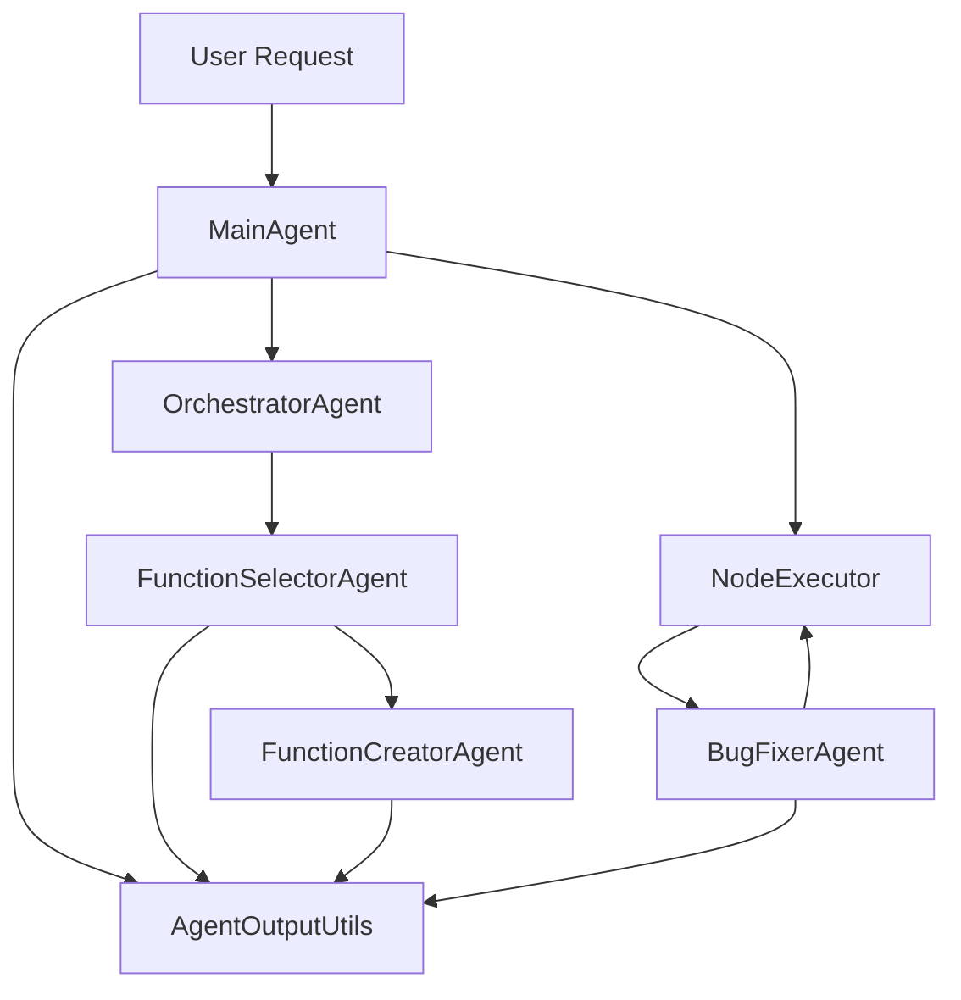

# Agent Implementation Guide

## Overview

The RagOmics Agent system implements a hierarchical multi-agent architecture for automated bioinformatics analysis workflows. This guide covers the implementation details, design patterns, and best practices based on the current implementation.

## Table of Contents

1. [Agent Architecture](#agent-architecture)
2. [Agent Responsibilities](#agent-responsibilities)
3. [Implementation Details](#implementation-details)
4. [Function Block Framework](#function-block-framework)
5. [Output Directory Structure](#output-directory-structure)
6. [Agent Logging System](#agent-logging-system)
7. [Error Handling](#error-handling)
8. [Job Execution](#job-execution)
9. [LLM Integration](#llm-integration)
10. [Testing Infrastructure](#testing-infrastructure)
11. [Best Practices](#best-practices)
12. [Configuration](#configuration)
13. [Common Patterns](#common-patterns)
14. [Debugging Tools](#debugging-tools)

## Agent Architecture

### Agent Hierarchy

```
MainAgent (System Orchestrator)
├── OrchestratorAgent
│   ├── Workflow Planning
│   ├── Parallel Execution
│   └── Tree State Management
├── FunctionSelectorAgent
│   ├── Function Block Selection
│   ├── Creation Coordination
│   └── Satisfaction Analysis
├── FunctionCreatorAgent
│   ├── Code Generation
│   ├── Requirements Definition
│   └── Parameter Configuration
└── BugFixerAgent
    ├── Pattern-Based Fixes
    ├── LLM-Based Debugging
    └── Version Management
```

### Inter-Agent Communication



## Agent Responsibilities

### MainAgent (`agents/main_agent.py`)

**Primary Role**: System orchestrator coordinating all workflow components

**Key Responsibilities**:
- Parse and validate user requests
- Initialize and coordinate specialized agents
- Create and manage analysis tree structure
- Execute nodes through NodeExecutor
- Handle failed nodes with bug fixing
- Implement iterative tree expansion
- Manage output directory structure

**Key Methods**:
```python
def analyze(
    self,
    user_request: str,
    input_data_path: Path,
    output_dir: Path,
    llm_model: str = "gpt-4o-mini",
    generation_mode: str = "new_only",
    max_iterations: int = 10,
    verbose: bool = False
) -> Dict[str, Any]:
    """Main entry point for analysis."""

def _generate_and_execute_plan(
    self,
    tree: AnalysisTree,
    input_path: Path,
    output_dir: Path,
    verbose: bool,
    main_task_dir: Path,
    max_iterations: int = 10
):
    """Iterative tree expansion and execution."""

def _execute_single_node(
    self,
    node: AnalysisNode,
    tree: AnalysisTree,
    input_path: Path,
    output_dir: Path,
    verbose: bool
) -> bool:
    """Execute individual node with error handling."""
```

### OrchestratorAgent (`agents/orchestrator_agent.py`)

**Primary Role**: Strategic planning and parallel execution management

**Key Responsibilities**:
- Plan analysis workflows based on requests
- Manage parallel node execution via job pools
- Make tree expansion decisions
- Determine request satisfaction
- Coordinate reactive tree expansion

**Key Features**:
- **Parallel Execution**: Uses JobPool for concurrent node execution
- **Dependency Management**: Tracks node dependencies
- **Reactive Expansion**: Creates nodes based on completion
- **Progress Monitoring**: Tracks execution state

**Key Methods**:
```python
def plan_next_steps(self, orchestrator_task: Dict) -> Dict:
    """Generate recommendations for next steps."""

def execute_tree(
    self,
    tree: AnalysisTree,
    input_path: Path,
    output_dir: Path,
    mode: str = "parallel",
    max_parallel_jobs: int = 3
) -> Dict[str, Any]:
    """Execute tree with parallelism support."""
```

### FunctionSelectorAgent (`agents/function_selector_agent.py`)

**Primary Role**: Intelligent function block selection and creation coordination

**Key Responsibilities**:
- Analyze workflow progress and requirements
- Select existing function blocks from library
- Coordinate new function block creation
- Determine request satisfaction
- Manage generation modes (new/existing/mixed)

**Selection Process**:
1. Analyze current tree state and data
2. Determine required analysis steps
3. Check library for existing blocks
4. Request creation of new blocks if needed
5. Validate selections meet requirements

**Key Methods**:
```python
def select_next_functions(
    self,
    user_request: str,
    current_node: Optional[AnalysisNode],
    parent_nodes: List[AnalysisNode],
    data_summary: Dict[str, Any],
    generation_mode: GenerationMode,
    max_branches: int = 3
) -> Dict[str, Any]:
    """Select or create function blocks."""
```

### FunctionCreatorAgent (`agents/function_creator_agent.py`)

**Primary Role**: Generate new function blocks with proper framework compliance

**Key Responsibilities**:
- Generate Python/R code using LLM
- Implement standardized function signatures
- Create requirements and configurations
- Ensure framework compliance
- Add comprehensive error handling

**Framework Requirements**:
```python
def run(path_dict, params):
    """
    REQUIRED SIGNATURE for all function blocks.
    
    Args:
        path_dict: Dict with 'input_dir' and 'output_dir'
        params: Dict of analysis parameters
    """
    # Load data
    input_path = os.path.join(path_dict["input_dir"], "_node_anndata.h5ad")
    adata = sc.read_h5ad(input_path)
    
    # Process...
    
    # Save data
    output_path = os.path.join(path_dict["output_dir"], "_node_anndata.h5ad")
    adata.write(output_path)
```

### BugFixerAgent (`agents/bug_fixer_agent.py`)

**Primary Role**: Automated debugging and error recovery

**Key Responsibilities**:
- Analyze execution errors and logs
- Apply pattern-based common fixes
- Use LLM for complex debugging
- Manage fix versions and attempts
- Update requirements as needed

**Fix Strategy**:
1. **Pattern Matching**: Common error patterns
   - Import errors → Add missing imports
   - Attribute errors → Fix method calls
   - Type errors → Correct data types
   - Path errors → Fix file paths

2. **LLM Debugging**: Complex errors
   - Build detailed error context
   - Include stdout/stderr logs
   - Request targeted fixes
   - Validate fix correctness

### AgentOutputUtils (`agents/agent_output_utils.py`)

**Primary Role**: Centralized logging and tracking

**Key Responsibilities**:
- Log all LLM interactions
- Track bug fix attempts
- Record function selections
- Manage code versions
- Generate task summaries

## Implementation Details

### Base Classes

#### BaseAgent
```python
class BaseAgent:
    """Base class for all agents."""
    
    def __init__(self, name: str, task_manager=None):
        self.name = name
        self.task_manager = task_manager
        self.logger = setup_logger(f"{__name__}.{name}")
    
    def process(self, context: Dict[str, Any]) -> Any:
        """Process agent task."""
        raise NotImplementedError
    
    def validate_context(self, context: Dict, required_keys: List[str]):
        """Validate required context keys."""
        missing = [k for k in required_keys if k not in context]
        if missing:
            raise ValueError(f"Missing required context keys: {missing}")
```

## Function Block Framework

### Standard Signatures

#### Python Function Blocks
```python
def run(path_dict, params):
    """
    Standard Python function block interface.
    
    Parameters
    ----------
    path_dict : dict
        Dictionary containing:
        - input_dir: Path to input directory
        - output_dir: Path to output directory
    params : dict
        Analysis parameters
    
    Returns
    -------
    Any
        Processed data (typically AnnData object)
    """
    import scanpy as sc
    import os
    
    # Load data
    input_path = os.path.join(path_dict["input_dir"], "_node_anndata.h5ad")
    adata = sc.read_h5ad(input_path)
    
    # Process data using params
    if params.get("normalize", True):
        sc.pp.normalize_total(adata)
    
    # Save outputs
    output_path = os.path.join(path_dict["output_dir"], "_node_anndata.h5ad")
    adata.write(output_path)
    
    # Save figures if any
    figures_dir = os.path.join(path_dict["output_dir"], "figures")
    os.makedirs(figures_dir, exist_ok=True)
    
    return adata
```

#### R Function Blocks
```r
run <- function(path_dict, params) {
    #' Standard R function block interface
    #' 
    #' @param path_dict List with input_dir and output_dir
    #' @param params List of analysis parameters
    #' @return Processed Seurat object
    
    library(Seurat)
    
    # Load data
    input_path <- file.path(path_dict$input_dir, "_node_seuratObject.rds")
    seurat_obj <- readRDS(input_path)
    
    # Process data
    if (params$normalize) {
        seurat_obj <- NormalizeData(seurat_obj)
    }
    
    # Save outputs
    output_path <- file.path(path_dict$output_dir, "_node_seuratObject.rds")
    saveRDS(seurat_obj, output_path)
    
    return(seurat_obj)
}
```

### Standard I/O Conventions

| Language | Input File | Output File | Figure Directory |
|----------|-----------|-------------|------------------|
| Python | `_node_anndata.h5ad` | `_node_anndata.h5ad` | `figures/` |
| R | `_node_seuratObject.rds` | `_node_seuratObject.rds` | `figures/` |

## Output Directory Structure

### Complete Directory Tree

```
output_dir/
├── analysis_tree.json                      # Complete tree structure
├── DIRECTORY_TREE.md                       # Visual representation
├── {tree_id}/                              # Tree-specific directory
│   ├── main_task/                          # Main agent logs
│   │   ├── agent_info.json                 # Configuration
│   │   └── orchestrator_tasks/             # Planning logs
│   │       └── task_{iteration}.json       # Iteration logs
│   └── nodes/                              # Flat node structure
│       └── node_{node_id}/                 # Individual node
│           ├── node_info.json              # Node metadata
│           ├── function_block/             # Code definition
│           │   ├── code.py                 # Function code
│           │   ├── config.json             # Static config
│           │   └── requirements.txt        # Dependencies
│           ├── agent_tasks/                # Agent activities
│           │   ├── function_creator/       # Creation logs
│           │   │   ├── creation_1.json     # Creation metadata
│           │   │   └── code_versions/      # Code history
│           │   │       └── v1_initial.py   # Initial version
│           │   ├── function_selector/      # Selection logs
│           │   │   └── selection_1.json    # Selection process
│           │   └── bug_fixer/              # Fix attempts
│           │       ├── bug_fixes/          # Fix metadata
│           │       │   └── fix_attempt_1.json
│           │       └── code_versions/      # Fixed versions
│           │           ├── v2_original.py  # Before fix
│           │           └── v2_fixed.py     # After fix
│           ├── jobs/                       # Execution history
│           │   └── job_{timestamp}/         # Job instance
│           │       ├── execution_summary.json
│           │       └── output/              # Job outputs
│           │           ├── _node_anndata.h5ad
│           │           ├── figures/         # Visualizations
│           │           └── past_jobs/       # History
│           │               └── {timestamp}_{status}_{id}/
│           │                   ├── stdout.txt
│           │                   ├── stderr.txt
│           │                   ├── job_metrics.csv
│           │                   └── job_info.json
│           └── outputs/                     # Final outputs
│               ├── _node_anndata.h5ad       # Main output
│               └── figures/                 # All figures
```

## Agent Logging System

### AgentOutputLogger Class

```python
class AgentOutputLogger:
    """Centralized logging for agent activities."""
    
    def __init__(self, node_dir: Path, agent_name: str):
        self.node_dir = Path(node_dir)
        self.agent_name = agent_name
        self.agent_tasks_dir = self.node_dir / "agent_tasks"
        self.agent_dir = self.agent_tasks_dir / agent_name
        
    def log_llm_interaction(
        self,
        task_type: str,
        llm_input: Dict[str, Any],
        llm_output: Optional[Dict[str, Any]] = None,
        error: Optional[str] = None,
        metadata: Optional[Dict[str, Any]] = None
    ) -> Path:
        """Log LLM interaction with full context."""
        
    def log_bug_fix_attempt(
        self,
        attempt_number: int,
        error_info: Dict[str, Any],
        fix_strategy: str,
        llm_input: Dict[str, Any],
        llm_output: Optional[Dict[str, Any]] = None,
        fixed_code: Optional[str] = None,
        success: bool = False
    ) -> Path:
        """Log bug fix attempt with versions."""
```

### Logging Locations by Agent

| Agent | Log Location | Content |
|-------|-------------|---------|
| FunctionCreator | `agent_tasks/function_creator/` | Creation prompts, responses, code versions |
| FunctionSelector | `agent_tasks/function_selector/` | Selection process, reasoning |
| BugFixer | `agent_tasks/bug_fixer/` | Fix attempts, strategies, versions |
| Orchestrator | `main_task/orchestrator_tasks/` | Planning decisions, tree state |

## Error Handling

### Error Detection Pipeline

1. **Execution Monitoring**: Track exit codes and timeouts
2. **Output Validation**: Verify expected files exist
3. **Log Analysis**: Parse stdout/stderr for errors
4. **State Management**: Update node states appropriately

### Bug Fixing Strategy

#### Pattern-Based Fixes
```python
COMMON_FIXES = [
    {
        'pattern': r"ModuleNotFoundError: No module named '(\w+)'",
        'fix': lambda m: f"import {m.group(1)}"
    },
    {
        'pattern': r"AttributeError: .* has no attribute '(\w+)'",
        'fix': lambda m: f"# Fixed attribute error for {m.group(1)}"
    },
    {
        'pattern': r"FileNotFoundError: .* '(.+)'",
        'fix': lambda m: f"# Fixed path: {m.group(1)}"
    }
]
```

#### LLM-Based Debugging
```python
def _fix_with_llm(self, error_info: Dict) -> Dict:
    """Use LLM for complex debugging."""
    prompt = self._build_debug_prompt(
        code=error_info['function_block'].code,
        error=error_info['error_message'],
        stdout=error_info.get('stdout', ''),
        stderr=error_info.get('stderr', '')
    )
    
    response = self.llm_service.fix_code(prompt)
    return self._parse_fix_response(response)
```

## Job Execution

### NodeExecutor

Manages Docker-based execution of function blocks:

```python
class NodeExecutor:
    """Execute nodes in isolated containers."""
    
    def execute_node(
        self,
        node: AnalysisNode,
        tree: AnalysisTree,
        input_path: Path,
        output_base_dir: Path
    ) -> Tuple[NodeState, Optional[str]]:
        """
        Execute node in Docker container.
        
        Returns:
            Tuple of (execution_state, output_path)
        """
        # 1. Create node directory structure
        # 2. Prepare function block code
        # 3. Execute in Docker container
        # 4. Collect outputs and logs
        # 5. Update node state
```

### ExecutorManager

Coordinates language-specific executors:

```python
class ExecutorManager:
    """Manage Python and R executors."""
    
    def __init__(self):
        self.python_executor = PythonExecutor(docker_manager)
        self.r_executor = RExecutor(docker_manager)
        
    def execute(self, function_block: FunctionBlock, ...) -> ExecutionResult:
        """Route to appropriate executor."""
        if function_block.type == FunctionBlockType.PYTHON:
            return self.python_executor.execute(...)
        elif function_block.type == FunctionBlockType.R:
            return self.r_executor.execute(...)
```

## LLM Integration

### OpenAIService

```python
class OpenAIService:
    """OpenAI API integration."""
    
    def __init__(self, api_key: str, model: str = "gpt-4o-mini"):
        self.client = OpenAI(api_key=api_key)
        self.model = model
        
    def chat_completion_json(
        self,
        messages: List[Dict],
        json_schema: Dict,
        temperature: float = 0.7,
        max_tokens: int = 4000
    ) -> Dict:
        """Get structured JSON response."""
        
    def generate_code(
        self,
        prompt: str,
        language: str = "python"
    ) -> str:
        """Generate code for function blocks."""
```

### Prompt Engineering

#### System Prompts
```python
FUNCTION_CREATOR_SYSTEM = """
You are an expert bioinformatics function block creator.

CRITICAL REQUIREMENTS:
1. Use signature: def run(path_dict, params)
2. Load from: path_dict["input_dir"]
3. Save to: path_dict["output_dir"]
4. Use standard file names (_node_anndata.h5ad)
"""

BUG_FIXER_SYSTEM = """
You are an expert debugger for bioinformatics code.

REQUIREMENTS:
1. Maintain function signature
2. Fix errors while preserving functionality
3. Add missing imports
4. Correct file paths
"""
```

## Testing Infrastructure

### Test Organization

```
tests/
├── agents/                      # Agent-specific tests
│   ├── test_main_agent.py
│   ├── test_bug_fixer.py
│   └── test_function_creator.py
├── clustering/                  # Benchmark tests
│   └── test_clustering_simulation.py
├── openai_integration/          # LLM tests
│   └── test_with_openai.py
└── test_path_dict_simple.py    # Framework tests
```

### Key Test Patterns

#### Mocked Agent Testing
```python
def test_with_mocked_agents():
    """Test without LLM calls."""
    main_agent = MainAgent(
        tree_manager=MockTreeManager(),
        orchestrator=MockOrchestrator(),
        function_selector=MockSelector(),
        function_creator=MockCreator(),
        bug_fixer=MockFixer()
    )
    
    result = main_agent.analyze(...)
    assert result['completed_nodes'] > 0
```

#### Output Structure Validation
```python
def test_output_structure():
    """Verify directory structure compliance."""
    # Execute analysis
    result = main_agent.analyze(...)
    
    # Check structure
    tree_dir = Path(result['output_dir']) / result['tree_id']
    assert (tree_dir / 'nodes').exists()
    assert (tree_dir / 'analysis_tree.json').exists()
    
    # Check node structure
    for node_dir in (tree_dir / 'nodes').iterdir():
        assert (node_dir / 'node_info.json').exists()
        assert (node_dir / 'function_block').exists()
        assert (node_dir / 'agent_tasks').exists()
```

## Best Practices

### 1. Agent Design
- **Single Responsibility**: Each agent has one clear purpose
- **Context Validation**: Always validate inputs
- **Comprehensive Logging**: Log all significant activities
- **Error Recovery**: Implement graceful error handling

### 2. Function Block Creation
- **Framework Compliance**: Use `run(path_dict, params)`
- **Standard I/O**: Use conventional file names
- **Error Handling**: Include try-catch blocks
- **Documentation**: Clear docstrings

### 3. Output Organization
- **Strict Separation**: Keep agent logs in `agent_tasks/`
- **Version Control**: Track all code versions
- **Job History**: Maintain execution history
- **Clean Structure**: Follow directory conventions

### 4. Testing Strategy
- **Unit Tests**: Test agents in isolation
- **Integration Tests**: Test agent interactions
- **Simulation Tests**: Test without external dependencies
- **Validation Tests**: Verify output structures

## Configuration

### Environment Variables

```bash
# Required
OPENAI_API_KEY=sk-...

# Optional
OPENAI_MODEL=gpt-4o-mini
# Note: The following are documented but not yet implemented as env vars:
# RAGOMICS_MAX_PARALLEL_JOBS=3  # Currently configured in code
# RAGOMICS_FUNCTION_BLOCK_TIMEOUT=600  # Currently in config.py
# RAGOMICS_TEMP_DIR=/tmp/ragomics  # Currently in config.py
```

### Docker Images

```yaml
# docker-compose.yml
services:
  python-executor:
    image: ragomics/python-executor:latest
    build: ./docker/python
    
  r-executor:
    image: ragomics/r-executor:latest
    build: ./docker/r
```

## Common Patterns

### Context Validation Pattern
```python
def process(self, context: Dict) -> Any:
    """Process with validation."""
    required = ['user_request', 'tree', 'node']
    self.validate_context(context, required)
    
    # Safe to proceed
    return self._process_impl(context)
```

### Logging Pattern
```python
def create_function(self, task: Dict) -> FunctionBlock:
    """Create with logging."""
    if 'node_dir' in task:
        logger = AgentOutputLogger(task['node_dir'], 'function_creator')
        
        # Log LLM interaction
        log_path = logger.log_llm_interaction(
            task_type='create_function',
            llm_input={'prompt': prompt},
            llm_output={'code': code}
        )
    
    return function_block
```

### Error Recovery Pattern
```python
def execute_with_retry(self, node: AnalysisNode) -> bool:
    """Execute with automatic retry."""
    for attempt in range(max_attempts):
        try:
            result = self.execute_node(node)
            if result.success:
                return True
        except Exception as e:
            if attempt < max_attempts - 1:
                self.fix_and_retry(node, e)
            else:
                raise
    return False
```

## Debugging Tools

### Log Inspection Commands

```bash
# View agent creation logs
find output_dir -name "creation_*.json" -exec cat {} \;

# Check bug fix attempts
find output_dir -name "fix_attempt_*.json" -exec jq . {} \;

# View execution errors
find output_dir -name "stderr.txt" -exec tail -20 {} \;

# Tree structure
cat output_dir/*/analysis_tree.json | jq '.nodes | keys'

# Node states
cat output_dir/*/analysis_tree.json | jq '.nodes | .[] | {id: .id, state: .state}'
```

### Interactive Debugging

```python
# Debug script
from ragomics_agent_local.models import AnalysisTree
import json

# Load tree
with open('output_dir/tree_id/analysis_tree.json') as f:
    tree_data = json.load(f)
    
tree = AnalysisTree.from_dict(tree_data)

# Inspect nodes
for node_id, node in tree.nodes.items():
    print(f"{node.function_block.name}: {node.state}")
    if node.error:
        print(f"  Error: {node.error}")
```

## Performance Optimization

### Parallel Execution
- Use JobPool for independent nodes
- Configure max_parallel_jobs appropriately
- Monitor resource usage

### Caching
- Cache LLM responses when possible
- Reuse function blocks from library
- Store intermediate results

### Resource Management
- Clean temporary files after execution
- Limit container resource usage
- Implement timeouts for long-running tasks

## Future Enhancements

### Planned Features
1. **Web Interface**: Visual workflow designer
2. **Function Library**: Searchable function block repository
3. **Multi-Model Support**: Support for different LLM providers
4. **Distributed Execution**: Multi-machine support
5. **Interactive Mode**: User intervention points

### Extension Points
- Custom agent types via plugin system
- User-defined prompt templates
- Custom error fix patterns
- External tool integration
- Custom executors for new languages

## References

- [Agent Architecture](../AGENT_ARCHITECTURE.md)
- [Analysis Tree Structure](../ANALYSIS_TREE_STRUCTURE.md)
- [Function Block Framework](../../agents/FUNCTION_BLOCK_FRAMEWORK.md)
- [Parallel Execution Design](PARALLEL_EXECUTION_DESIGN.md)